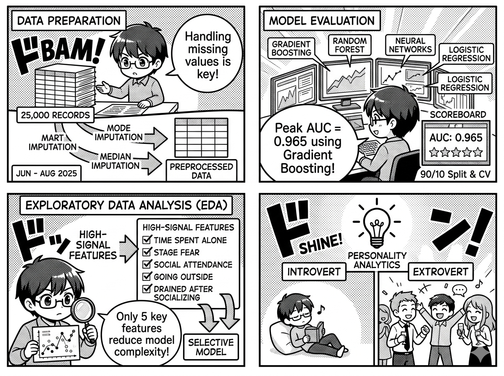

### Behavioral Personality Analytics

- Developed a robust classification pipeline to predict personality traits for 25,000+ records; implemented specialized preprocessing including mode and median imputation for missing values to preserve central tendency while ensuring resilience against outliers.
- Evaluated diverse architectures (Gradient Boosting, Random Forest, Neural Networks, Logistic Regression) using a 90/10 train-test split and 5/10-fold cross-validation; achieved a peak 0.965 AUC using Gradient Boosting on optimized feature set.
- Optimized model efficiency via feature selection, conducting EDA to isolate a high-signal 5-feature subset from the full dataset; maintained predictive performance while significantly reducing computational latency and model complexity.

  

